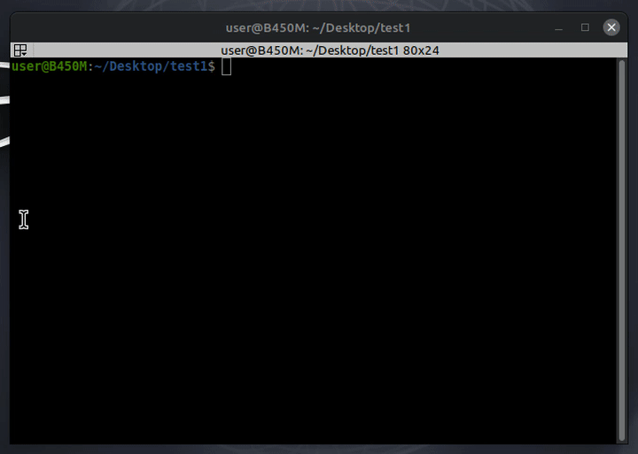

# tagd

Minimal CLI utility for storing file comments and tags inside local `.filetags` databases.  



## Commands

| Command | Description |
|---|---|
| `-s file comment` | set/update comment |
| `-g file` | get comment |
| `-r file` | remove comment |
| `-m old new` | rename tag entry |
| `-l [dir]` | list tags |
| `-c [dir]` | clean dead entries |

## Installation

```
pipx install nuitka
```
```
nuitka --onefile --follow-imports tagd.py
```
```
sudo mv dist/tagd /usr/local/bin/tagd
```
```
sudo chmod +x /usr/local/bin/tagd
```
